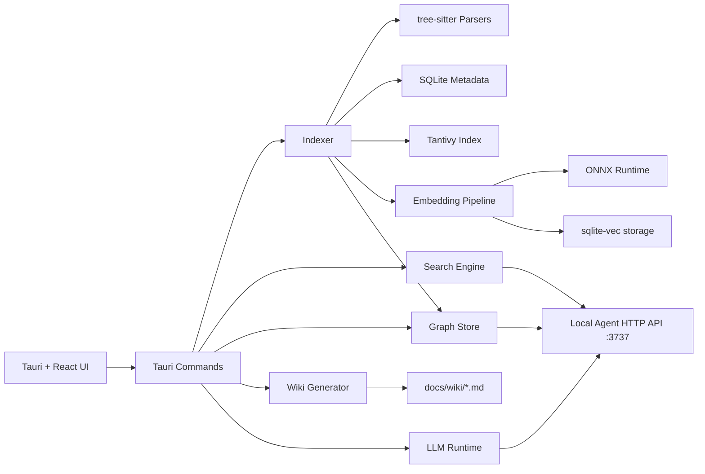

# Localbrain

Local-first codebase intelligence platform that builds a deterministic knowledge graph from source code and serves grounded answers with citations.

## Why

Developers need fast repository understanding without sending code to external services. Localbrain keeps indexing, graphing, search, and default inference on-device.

## Product Principles

- Local-first by default.
- No network dependency during indexing.
- Deterministic graph edges from parser/analyzers only.
- Human-editable wiki output.
- Local LLM default; cloud LLMs are optional BYOK.

## High-Level Architecture



## Runtime Components

1. Desktop UI

- React front-end in Tauri shell.
- Three-panel workflow: repository navigation, query/graph workspace, context/details panel.

2. Command Layer

- Strongly typed Tauri commands for indexing, search, graph traversal, wiki generation, LLM control, settings, and project lifecycle.

3. Indexer Pipeline

- Project root resolution.
- Deterministic file discovery/filtering.
- Incremental hashing and change detection.
- Parsing and symbol extraction.
- Metadata persistence.
- Search/vector index refresh.

4. Knowledge Graph

- Node examples: files, functions, classes, modules/components.
- Edge examples: `DEFINES`, `CALLS`, `IMPORTS`.
- Relationship creation from analyzers/parsers only.

5. Search Subsystem

- Keyword retrieval: Tantivy.
- Semantic retrieval: embeddings + sqlite-vec.
- Hybrid ranking/merge for recall + precision.

6. LLM Subsystem

- Default local runtime (llama.cpp workflow).
- Optional cloud providers only through explicit BYOK settings.
- Answers grounded in local indexed artifacts.

7. Wiki Subsystem

- Generates markdown artifacts under `docs/wiki/`.
- Files remain human-editable and git-trackable.
- Save flow is explicit and approval-based.

8. Local Agent API

- HTTP server on `127.0.0.1:3737`.
- Endpoints: `/explain`, `/find`, `/where`, `/save`, `/status`.
- Designed for local tool integrations.

## Data Model (Logical)

1. File Metadata (SQLite)

- Relative path, hash/signature, language, timestamps, parse/index status.

2. Knowledge Graph (Kuzu)

- Nodes for code entities.
- Deterministic edges for relationships.
- Query surface for traversal/explanation context.

3. Search Index (Tantivy)

- Inverted index over document/chunk fields.

4. Vector Store (sqlite-vec)

- Embedding vectors for chunk-level semantic retrieval.

5. Wiki Artifacts (Markdown)

- Human-readable, source-linked, user-editable documentation.

## End-to-End Flows

### Flow A: Project Indexing

1. User selects workspace.
2. App resolves canonical project root.
3. Indexer scans indexable files and computes signatures.
4. Changed/new files are parsed with tree-sitter.
5. Metadata and graph entities are updated.
6. Tantivy and vector indexes are rebuilt or incrementally refreshed.
7. UI receives progress events and final snapshot.

### Flow B: Explain / Query

1. User asks a question.
2. Search retrieves candidate chunks (keyword + semantic).
3. Graph context resolves related symbols/references.
4. Local LLM synthesizes response from retrieved context.
5. UI renders response with citations.

### Flow C: Wiki Save

1. User approves generated content.
2. Save operation writes/patches markdown in wiki directory.
3. Existing user edits are preserved by append/patch strategy.

## Security and Privacy Design

- Default operation is local/offline for indexing and graph creation.
- No telemetry by default.
- Cloud use is opt-in and BYOK.
- Provider credentials are stored in OS keychain flows (not plain files).
- No secrets in logs or generated docs.

## Reliability and Performance Strategy

- Incremental indexing to reduce reprocessing.
- Time-bounded long-running steps with user-visible progress.
- Local cache/snapshot reuse for previously loaded projects.
- Narrow, deterministic parsing and extraction for reproducibility.

## Repository Layout

- `src/`: React UI, state, and client-side orchestration.
- `src-tauri/`: Rust core, commands, indexing/search/graph/LLM/api modules.
- `docs/`: generated and curated project docs.
- `context/`: architecture, standards, specs, and progress tracker.

## Build and Run

### Prerequisites

- Node.js 18+
- npm
- Rust toolchain
- Tauri prerequisites for the target OS

### Dev

```bash
npm install
npm run tauri:dev
```

### Quality Gates

```bash
npm run typecheck
npm run lint
npm run build
```

## API Summary (Local Agent Server)

- `GET /status`: service health and readiness.
- `POST /find`: symbol definition lookup.
- `POST /where`: reference lookup.
- `POST /explain`: grounded explanation workflow.
- `POST /save`: persist approved wiki content.

## Roadmap Direction

- V1 complete on local-first core and distribution baseline.
- Deferred V2 scope: cloud provider depth and full keychain/provider hardening track.

## License

Internal project license policy applies unless replaced with a repository-level `LICENSE`.
